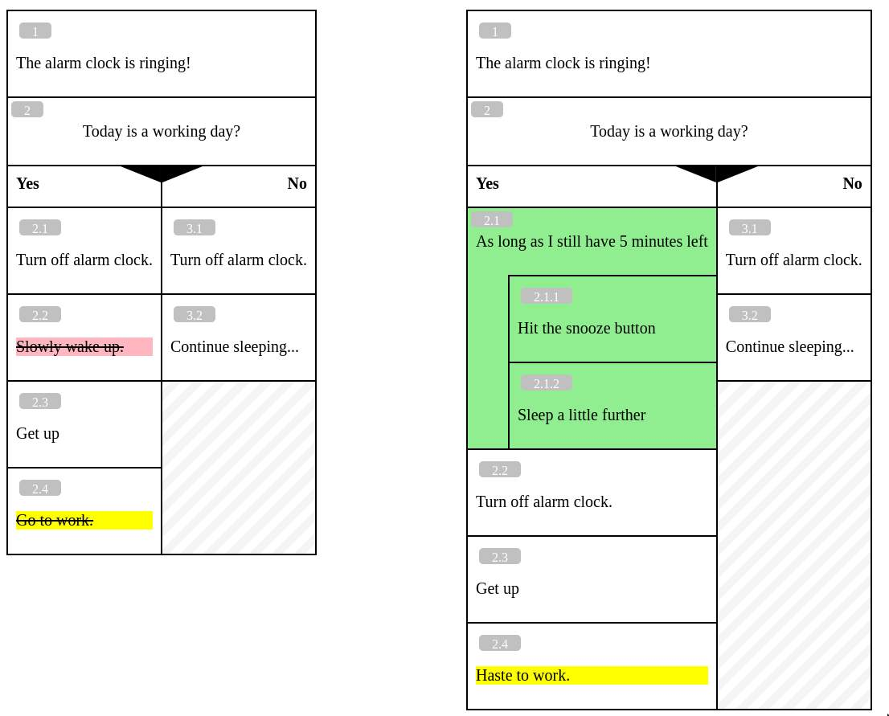

## nassi

*nassi* is a tool, that allows you to generate Nassi-Shneiderman-like diagrams from textual representation.

Here at [Phoenix Reisen GmbH](https://www.phoenixreisen.com/) we mainly use *nassi* to create software specifications / Use Cases.

### Generating diagrams

Let's start with a simple [example](/examples/ex1.nassi): 

```
The alarm clock is ringing!

IF Today is a working day? {
  Turn off alarm clock.
  Stand up
  Go to work.
}
ELSE {
  Turn off alarm clock.
  Continue sleeping
}
```

BTW, if you're using Vim, you're lucky - there is a [Vim syntax file](extra/nassi.vim) for *nassi* source files.

In order to generate the diagram, we call *nassi* as follows (assuming we're in *nassi*s' the project root dir):

```
java -jar bin/nassi.jar -o ex1.html examples/ex1.nassi
```

This is what the resulting diagram looks like:


### Diffing

Ok, now let's refine our [morning routine](example/ex2.nassi) and make it more realistic:

```
The alarm clock is ringing!

IF Today is a working day? {
  WHILE As long as I still have 5 minutes left {
    Hit the snooze button
    Sleep a little further
  }
  Turn off alarm clock.
  Stand up
  Haste to work.
}
ELSE {
  Turn off alarm clock.
  Continue sleeping
}
```

To highlight the changes between our original morning routine and the revised one, we can generate [this side-by-side diff](examples/diff-ex1-ex2.html) like so:

```
java -jar bin/nassi.jar -o diff.html --diff examples/ex1.nassi examples/ex2.nassi
```

And here is the resulting diff:



## Usage

The executable JAR is in the `bin` directory.

```
$ java -jar bin/nassi.jar
```


## Build standalone JAR file

```
$ lein clean; lein uberjar
```


## License

Copyright (c) 2024 Phoenix Reisen GmbH

BSD 3-Clause (see file LICENSE).
