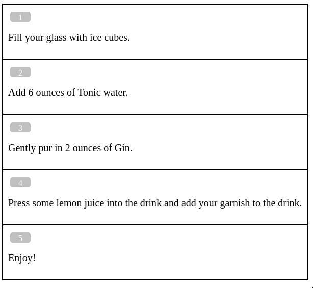

## nassi

*nassi* is a tool, that allows you to generate Nassi-Shneiderman-like diagrams from textual representations.

Here at [Phoenix Reisen GmbH](https://www.phoenixreisen.com/) use *nassi* extensively to create software specifications.


### Hello, World!

Let's start with the most basic [example](/examples/ex0.nassi) - a Gin and Tonic recipe:
 
```
Fill your glass with ice cubes.
Add 6 ounces of Tonic water.
Gently pur in 2 ounces of Gin.
Press some lemon juice into the drink and add your garnish to the drink.

Enjoy!
```

In order to generate the diagram, call *nassi* as follows (assuming we're in *nassi*s' project root dir):

```
java -jar bin/nassi.jar -o ex0.html examples/ex0.nassi
```

This is what the resulting diagram looks like:



As you can see, each line of the input file gets transformed to a single step in the resulting diagram (and empty lines are ignored).

Admittedly, strucure-wise our "Gin and Tonic" recipe is a bit boring. So read on, to learn how to create more interesting specifications.


### Keywords

In terms of syntax, *nassi* has a lot to offer. 
Here are the keywords, that *nassi* understands:

| Keyword | Example |
| ------- | ------- |
| IF      | `IF happy? { smile }` |
| ELSE    | `IF happy? { smile } ELSE { cry }` |
| SWITCH  | `SWITCH color { ... }` |
| CASE    | `CASE yellow { bananas }` |
| DEFAULT | `DEFAULT pink { panther }` or `DEFAULT { forty-two }` |
| FOR     | `FOR all candy { eat }` |
| WHILE   | `WHILE candy left? { eat }` |
| UNTIL   | `UNTIL bottle empty? { drink }` |
| SUB     | `SUB yellow { bananas }`
| THROW   | `THROW #wrong-password given password is incorrect` |
| CATCH   | `CATCH { HANDLE ... }` |
| HANDLE  | `HANDLE #wrong-password { note a failed login attempt }` |
| INCLUDE | `INCLUDE "other-diagram.nassi"` |

Let's do another simple [example](/examples/ex1.nassi) where we use an IF/ELSE statementds:

```
The alarm clock is ringing!

IF Today is a working day? {
  Turn off alarm clock.
  Slowly wake up.
  Get up
  Go to work.
}
ELSE {
  Turn off alarm clock.
  Continue sleeping...
}
```

BTW, if you're using Vim, you're lucky - there is a [Vim syntax file](extra/nassi.vim) for *nassi* source files.

This is what the resulting diagram looks like:


### Diffing

Ok, now let's refine our [morning routine](example/ex2.nassi) and make it more realistic:

```
The alarm clock is ringing!

IF Today is a working day? {
  WHILE As long as I still have 5 minutes left {
    Hit the snooze button
    Sleep a little further
  }
  Turn off alarm clock.
  Get up
  Haste to work.
}
ELSE {
  Turn off alarm clock.
  Continue sleeping... 
}
```

To highlight the changes between our original morning routine and the revised one, we can generate a side-by-side diff like so:

```
java -jar bin/nassi.jar -o diff.html --diff examples/ex1.nassi examples/ex2.nassi
```

And here is what the resulting diff looks like:


The original diagram is displayed on the left, the revised diagram is displayed on the right hand side:

- steps that got deleted are marked red in the original diagram
- newly added steps are marked green in the revised diagram
- steps that got changed are marked yellow in both diagrams

Small side note: if you don't like the default colors and want to use other colors instead, you can do so with the options `--opt-bgcol-delete`, `--opt-bgcol-insert` and `--opt-bgcol-change`. 

### Markdown

Somtimes it's useful to include pictures in a specification, or hyperlinks, or to use bold or emphasized text. For that reason [Markdown](https://github.github.com/gfm/) can be used to format the individual steps of a specification more nicely. 

Let's try this in an [example](/examples/ex3.nassi):

```
SUB ## User wants to save a file 
{
  !!user-enters-fname User enters a file name and hits the **save** button.

  The system checks, that all charaters of the file name are contained in the [POSIX portable file name character set](https://www.ibm.com/docs/en/zos/2.2.0?topic=locales-posix-portable-file-name-character-set).

  IF Is filename ok? {
    System saves the file
  }
  ELSE {
    System tells user to enter a valid file name. 
    continue at step [!!user-enters-fname](#user-enters-fname)
  }
}
```

Apart from the *nassi* keyword _SUB_, which we are using here for the first time to group steps, we use quite a bit of markdown in the example:

- we use `##` to define a H2 headline
- a word was marked as bold, using `**` to enclose it
- and there is a hyperlink to some external documentation

But the most interesting part is probably the link within the document (something that plain Markdown is not capable of on it's own).
If a step starts with an anchor (i.e. two exclamation marks followed by a group of characters that form a valid HTML identifier), that step can be referred to by other steps using the syntax `[!!my-id](#my-id)`.

Here's what the output looks like:


### More sophisticated specifications

Until now our example specifications were very simple. Each step was just a single sentence. But sometimes things aren't that simple and a step needs to be described in more detail. Whenever that need arises you can enclose that particular text in tripple double-quotes thus making it a paragraph.

Ok, let's see that in action! Here is finally a somewhat realistic [example](/examples/ex4.nassi):

```
""" ## User authentication

A user wants to login into the application. For this to happen, he needs an
security token, that will only be granted if he can successfully authenticate
himself. """

The user provides his "email address" and his "password".

"""
The system fetches the corresponding account based on the given "email
address" and compares the password, that was stored for that particular
account, with the given "password".

<i>Keep in mind, that we only store password hashes - so we have to hash the
given "password" first, before comparing it to the stored password hash!</i>
"""

THROW #unknown-email The system couldn't find an account for the given "email address".

THROW #account-blocked """The account is currently blocked.

<i>
There are two possible reasons for that:
  - The account is blocked temporarily (see step [!!block-account](#block-account)).
  - The account is blocked permanently (because of something that happened outside of this Use Case).
</i>
"""

THROW #wrong-password The system found the given "password" to be incorrect.

The system deletes all failed login attempts, for the users' account.

The system returns a security token. 

CATCH 
{
  HANDLE #unknown-email {
    !!error-wrong-username-password The system returns the error message “Login failed: wrong username / password.
  }
  HANDLE #account-blocked {
    IF Is the account temporarily blocked? {
      The system renews the current login lock (see step [!!block-account](#block-account)).
    }

    !!error-account-blocked The system returns the error message “Login failed: account currently blocked."
  }
  HANDLE #wrong-password {

    The system notes a failed login attempt.

    IF Was this the 3rd failed login attempt within the last 3 minutes? {
      !!block-account The system blocks the account temporarily for 5 minutes 
      continue with step [!!error-account-blocked](#error-account-blocked)
    }
    ELSE {
      continue with step [!!error-wrong-username-password](#error-wrong-username-password)
    }
  }
}
```

What's new here? For starters we defined some paragraphs (i.e.text blocks enclosed in `"""`). Aside from that we are using the exception handling mechanism (*nassi* keywords: _THROW_, _CATCH_ and _HANDLE_):

- We can define exceptional situations with the  _THROW_ keyword followed by an error-code (a hash sign followed by a letter followed by letters, digits, dahes or underscores, e.g. `#wrong-password`) followed by a sentence or paragraph describing the situation.

- Exception-handlers can be defined within _CATCH_ blocks, with the _HANDLE_ keyword followed by an error-code (s. above) and a block of steps.
 
Here is what the according diagram looks like:


### Pro Tip

While working on a specification it's very useful to have the textual representation and the resulting diagram in sync, so that whenever you save the textual represenation in your text editor, the diagram gets generated automatically. You can achieve this using the [entr](https://github.com/eradman/entr) command:


```
echo examples/ex1.nassi | entr -p java -jar bin/nassi.jar -o examples/ex1.html /_
  
```


## Usage

The executable JAR is in the `bin` directory.

```
$ java -jar bin/nassi.jar
```


## Build the executable

If you want (for whatever reason) to build the executable (a stand-alone JAR file) yourself, you need to execute the following [Leiningen](https://leiningen.org/) commands:


```
$ lein clean; lein uberjar
```


## License

Copyright (c) 2024 Phoenix Reisen GmbH

BSD 3-Clause (see file LICENSE).
